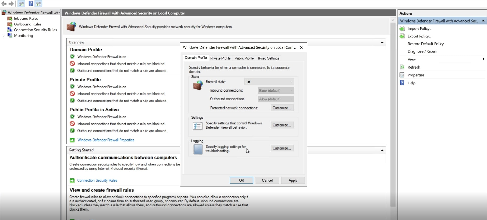

The primary goal of cyber security is to safeguard the computer environment of a company or user against attacks launched by malicious web surfers. There are various tools that researchers and security experts can use to protect the network they use, one of which is the “honeypot”. A honeypot is a computer configured to seem normal to an attacker that logs attack patterns and what the attacker does. These logs are then used by security experts to enhance the network’s security. In this paper, I’m going to create a honeypot for brute-force attacks using Azure, a cloud computing service operated by Microsoft. (Brute-force attacks consist of an attacker submitting passwords hoping to eventually guess correctly).

First of all, I’ll create a Windows 10 virtual machine to put online without any real way of defending itself, except for its password; I will disable every firewall, including the default one for Windows, “Microsoft Defender Firewall”. As the admin username, I won’t choose the default “administrator”, but something else. This way the virtual machine can also log the usernames that malicious users will try and I will drastically reduce the probability of a successful attack against the machine itself, because malicious users will have to guess the username, too.

Now, Microsoft Event Viewer. The event we’re interested in is Windows Security Log Event_ID 4625, “An account failed to log on”. What I am interested in is that Event Viewer logs the IP address that tried to log in as a user in the virtual machine. So, through a PowerShell script, all data Event Viewer can log can be extracted (IP addresses in particular) and forwarded to a third-party API to derive their geolocation data. For this lab, I will use ipgeolocation.io, an API that provides up to 1000 free requests per day.

Using Log Analytics Workspace in Azure is then possible to create a custom log file, containing one row for each malicious attempt and following the pattern: geographic information, IP address and username tried. Then, to split all these pieces of information, using Custom Fields of the Log Analytics Workspace seems to be the best way to go. Results:

Lastly, the Azure Sentinel workbook can be customized to display all the data gathered in a practical world map, according to the physical location and magnitude of the attacks. The final results are shown in the following map:

As we can see, 1000 requests for the geolocation data isn’t much, so the map pretty much shows just two attackers, one from Nicaragua and the other one from Colombia. What I noticed, while creating this lab, is that as soon as something is put on the Internet, whether it’s a computer or something totally different, people will try to get into it. No matter what it actually is, or whose it is, there are bots scouring the internet for networks to get into. So it doesn’t matter if you have got top secret files or just nothing, you are still going to be a target if you don’t have a firewall. Secondly, according to the lab data, you should avoid ADMINISTRATOR and ADMIN as usernames, as they are the most tried in this type of attacks.
